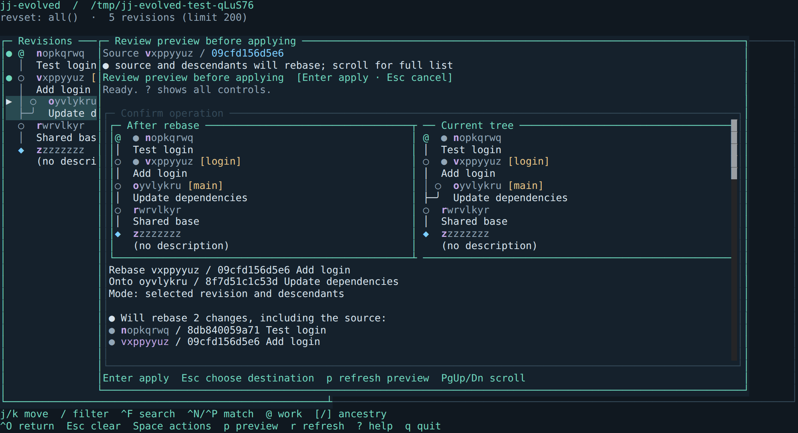

# jj-evolved

A keyboard-driven terminal UI for [Jujutsu](https://jj-vcs.dev/). Browse your revision graph, review diffs, and reshape a stack with previews of the resulting history.

Built with TypeScript, [Bun](https://bun.sh/), and [OpenTUI](https://github.com/anomalyco/opentui).

## Why jj-evolved?

Choosing a JJ client is largely about how you like to work with history. jj-evolved focuses on making the effects of an edit visible before you apply it, while keeping the revision graph at the center of the workflow.

Select a change, choose where it should go, and compare the proposed graph with the current one. Rebase and squash previews include bookmarks and conflict markers. With descendant rebasing, the app marks the moving changes and shows the full scope, including revisions outside the visible graph. Menus and editing forms keep the graph visible behind them so you can retain your place.

For example, suppose `Add login` and its child `Test login` branch from an older revision of `main`. Select `Add login`, press `r`, press `s` to include descendants, and choose the newer `main` as the destination. Enter opens the preview, with the proposed result on the left and the current tree on the right:



*Captured from the app’s OpenTUI renderer using a disposable example repository.*

Both marked changes move together, preserving their order above `main`. Review the new ancestry and any conflict markers before pressing Enter again to apply. Escape returns to destination selection; the preview itself leaves your working copy and live operation history unchanged.

Recovery is part of that workflow: inspect earlier versions of a change, review an undo, or restore a repository operation from the same interface. For detailed file editing, the app hands off to your configured JJ tools.

If your everyday work centers on reviewing and reshaping local stacks, that is the experience this project is built around. It also supports reviewed fetch/push and configurable browse keys; scripted workflows and custom themes are still outside its scope. See [current scope](#current-scope) for the remaining limits.

## What you can do

- **Explore your history.** Browse JJ’s native graph, inspect changed files and diffs, filter with revsets and bookmark/function completion, and search descriptions, bookmarks, or IDs across the active revset.
- **Edit a stack.** Create, describe, edit, rebase, squash, split, absorb, and abandon changes. Rebase and squash show the proposed and current graphs side by side before you apply.
- **Manage local bookmarks.** Create, rename, delete, or move bookmarks, including by dragging a bookmark onto another revision.
- **Sync with remotes.** Review fetches, push a selected bookmark, and manage bookmark tracking.
- **Review and recover.** Browse a change’s evolution, inspect repository operations, undo the latest operation, or restore an earlier state.
- **Use your existing editors.** Open JJ’s configured description, diff, and merge tools for external editing, interactive splits and squashes, and conflict resolution.

The app refreshes automatically as you work in other terminals. You can hide the preview to give the graph more room and choose from seven built-in themes, including one that uses your terminal’s colors.

## Try it

Run from source with **Bun 1.3+** and **`jj` on your PATH**. The verified toolchain is Bun 1.4.2 and jj 0.45.1; compatibility with other JJ versions is not yet guaranteed.

```bash
git clone https://github.com/jacobabahn/jj-evolved.git
cd jj-evolved
bun install
bun run demo
```

The demo opens a temporary repository with example changes. Experiment freely: the repository and your demo edits are deleted when you quit.

To open your own existing JJ repository, run this from the source checkout:

```bash
bun start /path/to/your/jj-repository
```

With no path, the app opens the current directory. It does not initialize a JJ repository for you. Press `q` or `Ctrl+C` to quit.

## Getting around

The default keys follow [jjui](https://github.com/idursun/jjui), so existing jjui users can keep their habits. See [custom keybindings](docs/usage.md#custom-keybindings) to change browse shortcuts or switch to the `legacy` preset with jj-evolved's earlier keys.

| Key | Action |
| --- | --- |
| `j` / `k`, arrows | Select a revision |
| `Tab` | Switch between the graph and preview |
| `p` | Hide or show the preview |
| `d` | Show the selected revision's diff |
| `l` / Right | Show the changed files in the left pane; `j` / `k` preview one file at a time, `h` / Left returns |
| `L` | Filter the graph with a revset |
| `/` | Search revisions; `'` / `"` step through matches |
| `Ctrl+L` | Load 200 more revisions |
| `Ctrl+R` | Refresh immediately |
| `@`, `[` / `]` | Jump to the working copy, a parent, or a child |
| `Space` | Open actions for the selected revision |
| Enter / `D` | Edit a multiline description in the app / in JJ's editor |
| `e` | Immediately make the selected revision the working copy |
| `n` | Create a child change after confirmation |
| `r` / `S` | Choose a rebase / squash destination in the graph |
| `s` / `a` | Split selected files / preview abandoning the change |
| `A` / `v` | Preview absorb / browse change evolution |
| `b` / `g` / `o` / `u` | Bookmarks / Git remotes / operation history / undo preview |
| `w` | Show working-copy status |
| `t` | Choose a theme |
| `?` | Show keyboard help |

For a first history edit, select a change, press `r`, and select its new parent. Press Enter to review the proposed graph, then Enter again to apply. Escape backs out before applying. Use `u` to review an undo afterward.

See the [usage guide](docs/usage.md) for all controls, search and navigation behavior, editor integration, and theme settings.

## Current scope

jj-evolved is under active development and focuses on local repository work. It runs your installed `jj` executable and follows JJ’s configuration and repository rules.

- **Remote operations:** fetch, push, and bookmark tracking are available through **Git remotes** in the action menu or bookmark browser. Configure remotes and authentication through the CLI.
- **Hunks and conflicts:** interactive hunk selection and conflict resolution use JJ’s configured external tools. There is no built-in hunk or merge editor.
- **Customization:** browse keybindings are configurable, with `jjui` and `legacy` presets; prompts retain their displayed controls. Revset completion covers bookmarks and common functions; custom aliases, scripted workflows, and custom themes are not implemented.
- **Large histories:** the graph starts with 200 revisions; `Ctrl+L` loads more. Search and destination pickers cover the full history; diffs and search metadata are buffered in memory.
- **Compatibility:** broader platform, terminal, and JJ-version coverage is still being established.

While browsing, automatic refresh runs `jj status`, which can snapshot pending working-copy edits. Reviewed actions reject stale repository state if another command or file edit changes it before confirmation. JJ remains responsible for validating operations.

## Development

```bash
bun install
bun dev /path/to/your/jj-repository
```

Before submitting a change, run:

```bash
bun run typecheck
bun run check:architecture
bun test
```

Tests require `jj` on your PATH and use disposable repositories. They exercise real JJ operations and the OpenTUI renderer, including keyboard workflows and snapshots.

To inspect recorded UI scenarios:

```bash
bun run ui gallery
bun run ui record rebase
```

The commands print a path to a browsable HTML gallery or recording. See [UI tooling](docs/ui-tooling.md) for adding scenarios and updating snapshots.

Bug reports and pull requests are welcome. For bugs, include your OS, terminal, Bun and JJ versions, and steps to reproduce with a small example repository when possible.

## Documentation

- [Usage guide](docs/usage.md) — controls, themes, and detailed workflows.
- [Feature specification](docs/features.md) — scope and acceptance criteria.
- [Implementation notes](docs/implementation.md) — architecture and repository operation handling.
- [UI tooling](docs/ui-tooling.md) — renderer tests, snapshots, and recordings.
